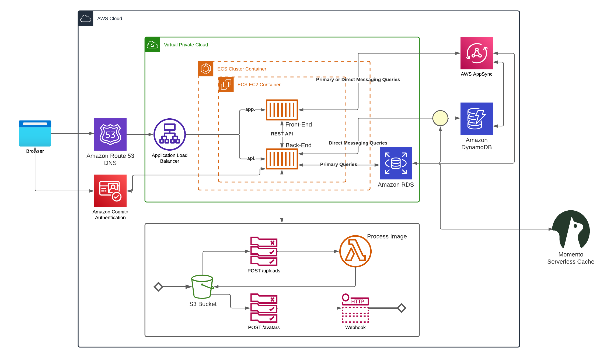
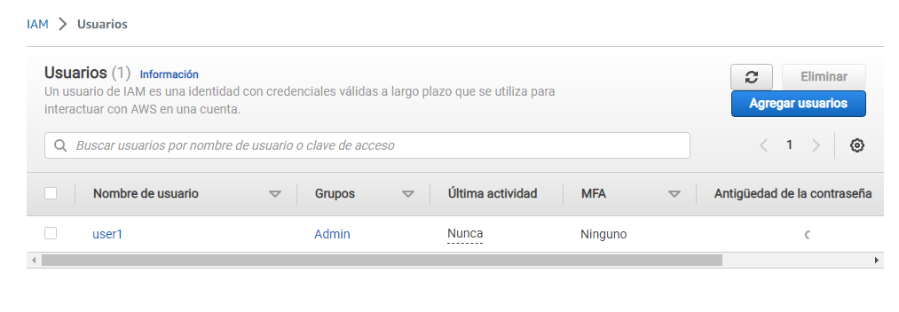
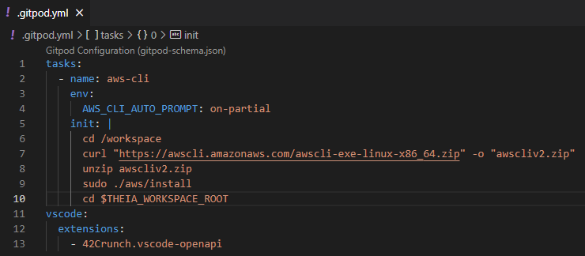
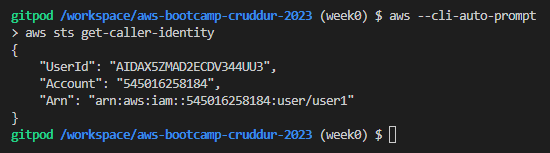
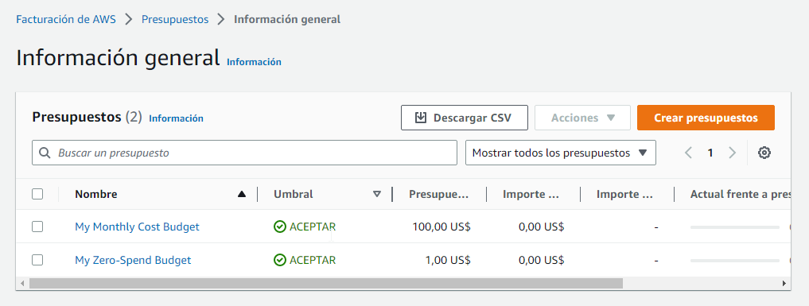
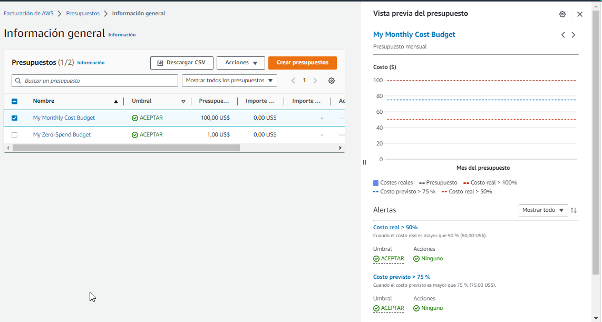

# Week 0 — Billing and Architecture

*[Week 0 - Live Stream Video](https://www.youtube.com/watch?v=SG8blanhAOg)*

[Recreation of architectural diagram](https://lucid.app/lucidchart/9c2a288c-fe9e-4c45-a3de-6df3714a3007/edit?viewport_loc=-182%2C-938%2C4824%2C1704%2C0_0&invitationId=inv_6dcfcf6a-118a-4fdb-8365-22968763f7b8): 

We first learned some [spend](https://www.youtube.com/watch?v=OVw3RrlP-sI) and [security](https://www.youtube.com/watch?v=4EMWBYVggQI) considerations such as how to set up roles and policies with the least privilege principle, using the root user as minimum as possible and creating an admin-roled user instead and best practices to avoid security breaches.

After that we created an [admin-roled user](https://www.youtube.com/watch?v=OdUnNuKylHg) for us to use instead of root user.

We created corresponding access keys for CLI usage and set it up in a gitpod container

then we learned how to create budgets and billing alarms through both CLI and GUI

