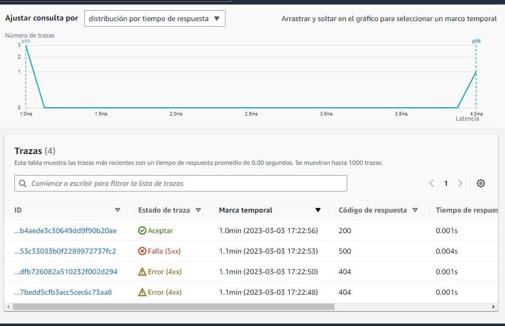

# Week 2 — Distributed Tracing

*[Week 2 - Live Stream Video](https://www.youtube.com/watch?v=2GD9xCzRId4)*
*[Spending Considerations](https://www.youtube.com/watch?v=2W3KeqCjtDY)*
*[Security Considerations](https://www.youtube.com/watch?v=bOf4ITxAcXc)*

This week we learned how to instrument a multi service application using HoneyComb, X-Ray, CloudWatch and Rollbar

### Instrumentation using HoneyComb with OpenTelemetry:

Honeycomb Traces

Honeycomb Queries Visualization

### Instrumentation using X-ray:

X-ray Traces

X-ray Map

### Logging with CloudWatch:

CloudWatch Log Flow

CloudWatch Logs

### Error logging with Rollbar

Rollbar Errors

