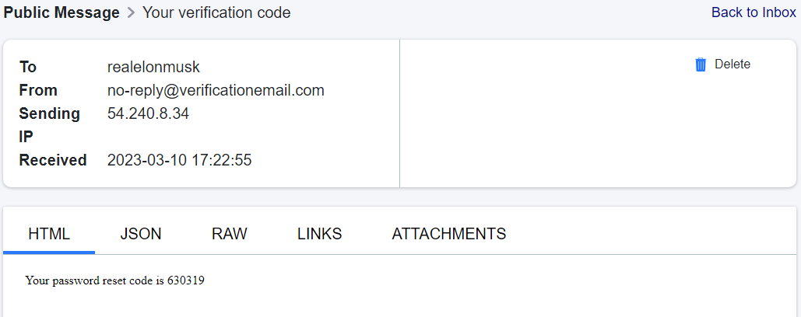

# Week 3 — Decentralized Authentication

*[Week 3 - Live Stream Video](https://www.youtube.com/watch?v=9obl7rVgzJw)*
*[Security Considerations](https://www.youtube.com/watch?v=tEJIeII66pY)*

## Authentication Workflow

### Sign Up

Sign up page 

### Email Confirmation

Verification code

Confirmation page

### Password Recovery

Recovery page

Reset code

Recovery successful

### Sign In

Sign in page

### Home Feed

Home feed page

### Cognito User Pool

